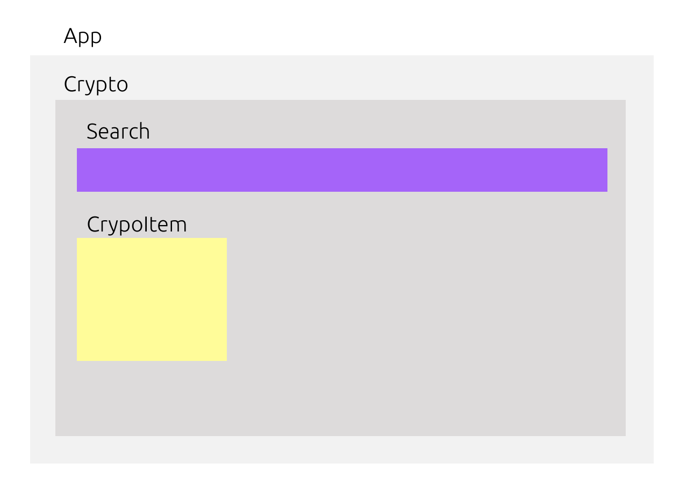
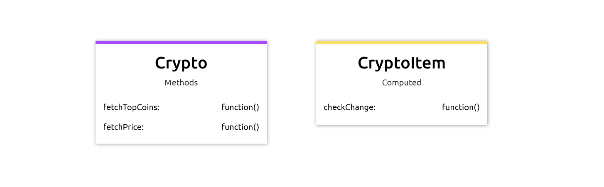

# CryptoWatcher


With CryptoWatcher you're able to see the 24h % changes of the top volume trading coins.

Link to application: https://cryptowatcher.netlify.com/dist/index.html

## Getting started

Install all dependencies
```
npm install
```

Run development build
```
npm run serve
```

Open at standard port
```
localhost:8080
```

## Vue component flow



## Function flow



